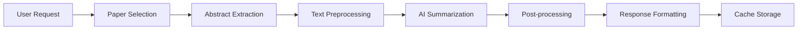

# AI-Powered Abstract Summarization Feature Specification

## Overview

This document outlines the specification for an AI-powered abstract summarization feature that will automatically generate comprehensive summaries of abstracts for searched topics or recent papers (within the last week). This feature will help users quickly understand trends and developments in their areas of interest.

## Feature Description

### Core Functionality

The AI summarization feature will provide two main capabilities:

1. **Topic-Based Summarization**: Generate summaries based on search queries/topics
2. **Recent Papers Summarization**: Automatically summarize abstracts from papers published in the last week

### Use Cases

1. **Researcher Workflow**: A researcher searching for "transformer architecture" can get an AI-generated summary of recent developments and trends
2. **Weekly Updates**: Users can receive weekly summaries of new papers in their field of interest
3. **Trend Analysis**: Identify emerging themes and patterns across multiple papers
4. **Quick Insights**: Get concise overviews without reading individual abstracts

## Technical Specification

### 1. Data Input

**For Topic-Based Summarization**:
- Input: Search query/topic keywords
- Source: Papers matching the search criteria
- Scope: All papers in database or within specified date range

**For Recent Papers Summarization**:
- Input: Time range (default: last 7 days)
- Source: Papers published within the specified time range
- Scope: All papers or filtered by categories/keywords

### 2. AI Integration Options

**Option A: OpenAI API Integration**
- Service: OpenAI GPT-4 or GPT-3.5-turbo
- Pros: High-quality summaries, established API
- Cons: API costs, external dependency

**Option B: Local LLM Integration**
- Service: Ollama with models like Llama 2/3, Mistral
- Pros: No API costs, privacy, offline capability
- Cons: Hardware requirements, setup complexity

**Option C: Hugging Face Transformers**
- Service: BART, T5, or similar summarization models
- Pros: Free, customizable, good performance
- Cons: Requires model hosting, computational resources

### 3. Data Processing Pipeline



**Step-by-Step Process**:

1. **Paper Selection**:
   - Query database for relevant papers
   - Apply filters (date range, topic, keywords)
   - Limit to reasonable number (e.g., 50-100 papers)

2. **Abstract Extraction**:
   - Extract abstracts from selected papers
   - Remove duplicates and low-quality content
   - Validate text quality and length

3. **Text Preprocessing**:
   - Clean and normalize text
   - Remove special characters and formatting
   - Chunk text if necessary for token limits

4. **AI Summarization**:
   - Send processed text to AI service
   - Apply appropriate prompts for different summary types
   - Handle API rate limits and errors

5. **Post-processing**:
   - Format and structure the summary
   - Add metadata (paper count, date range, etc.)
   - Validate output quality

6. **Response Formatting**:
   - Structure response for frontend consumption
   - Add relevant paper citations
   - Include summary statistics

### 4. API Design

**New Endpoints**:

```python
# Topic-based summarization
GET /api/v1/summarize/topic
Query Parameters:
- query: str (required) - Search topic/keywords
- start_date: str (optional) - Start date filter
- end_date: str (optional) - End date filter
- max_papers: int (optional, default: 50) - Maximum papers to include
- summary_type: str (optional, default: "comprehensive") - Type of summary

# Recent papers summarization
GET /api/v1/summarize/recent
Query Parameters:
- days: int (optional, default: 7) - Number of days back
- categories: list[str] (optional) - Filter by categories
- keywords: list[str] (optional) - Filter by keywords
- summary_type: str (optional, default: "weekly") - Type of summary
```

**Response Format**:
```json
{
  "summary": {
    "title": "AI-Generated Summary: Transformer Architecture",
    "content": "Recent developments in transformer architecture show...",
    "key_themes": [
      "Multi-head attention improvements",
      "Efficiency optimizations",
      "Novel applications"
    ],
    "paper_count": 45,
    "date_range": {
      "start": "2023-11-01",
      "end": "2023-11-08"
    }
  },
  "metadata": {
    "generated_at": "2023-11-08T10:30:00Z",
    "ai_model": "gpt-4",
    "processing_time": 12.5,
    "top_papers": [
      {
        "title": "Attention Is All You Need",
        "authors": ["Vaswani, A."],
        "relevance_score": 0.95
      }
    ]
  }
}
```

### 5. Frontend Integration

**New Components**:

1. **SummaryCard Component**:
   - Display AI-generated summaries
   - Show key themes and insights
   - Link to source papers

2. **SummaryRequest Component**:
   - Form for requesting topic summaries
   - Options for summary type and parameters
   - Integration with search functionality

3. **WeeklySummary Component**:
   - Automated weekly summaries
   - Subscription/notification options
   - Archive of past summaries

**UI/UX Considerations**:
- Clear indication of AI-generated content
- Loading states for processing time
- Options to view source papers
- Expandable detailed summaries
- Multi-language support for summaries

### 6. Performance Considerations

**Caching Strategy**:
- Cache summaries for 24 hours for topic-based requests
- Cache weekly summaries for 7 days
- Use query parameters as cache keys
- Implement cache invalidation on new papers

**Rate Limiting**:
- Limit API calls per user/IP
- Queue requests during high load
- Implement exponential backoff for AI service calls

**Resource Management**:
- Monitor AI service usage and costs
- Implement request queuing for batch processing
- Set limits on input text length and paper count

### 7. Quality Assurance

**Summary Quality Metrics**:
- Relevance to input topic
- Coherence and readability
- Factual accuracy
- Completeness of coverage

**Monitoring**:
- Track summary generation success rates
- Monitor AI service response times
- Log user feedback and ratings
- Track cache hit rates

### 8. Multi-language Support

**Internationalization**:
- Support summaries in multiple languages
- Detect source paper language
- Allow users to specify preferred summary language
- Translate key themes and insights

**Language-specific Considerations**:
- Different AI models for different languages
- Cultural context in summarization
- Technical term handling across languages

## Implementation Phases

### Phase 1: Basic Implementation (MVP)
- Topic-based summarization with OpenAI API
- Simple frontend integration
- Basic caching mechanism
- English language support only

### Phase 2: Enhanced Features
- Recent papers summarization
- Improved UI/UX with better visualization
- Multi-language support
- Advanced caching and performance optimization

### Phase 3: Advanced Capabilities
- Local LLM integration option
- Personalized summaries based on user preferences
- Integration with notification system
- Advanced analytics and insights

## Configuration Options

**Environment Variables**:
```bash
# AI Service Configuration
AI_SERVICE_TYPE=openai  # openai, huggingface, ollama
OPENAI_API_KEY=your_api_key
OPENAI_MODEL=gpt-4-turbo

# Summarization Settings
MAX_PAPERS_PER_SUMMARY=100
DEFAULT_SUMMARY_LENGTH=moderate  # short, moderate, detailed
CACHE_TTL_HOURS=24

# Rate Limiting
MAX_SUMMARIES_PER_HOUR=10
MAX_SUMMARIES_PER_DAY=50
```

## Security and Privacy

**Data Protection**:
- No sensitive data sent to external AI services
- Anonymize paper metadata if required
- Implement proper API key management
- Log and monitor AI service interactions

**User Privacy**:
- Optional user authentication for personalized summaries
- No storage of personal information in summaries
- Clear privacy policy for AI service usage

## Cost Estimation

**OpenAI API Costs** (estimated):
- GPT-4: ~$0.03 per 1K tokens
- Average summary request: ~5K tokens
- Cost per summary: ~$0.15
- Monthly cost for 1000 summaries: ~$150

**Alternative Options**:
- Hugging Face Inference API: Lower cost but setup required
- Local deployment: Higher infrastructure cost but no per-request fees

## Success Metrics

**User Engagement**:
- Number of summary requests per day/week
- User retention and repeat usage
- Time spent reading summaries vs. individual papers

**Quality Metrics**:
- User satisfaction ratings
- Accuracy of key themes identification
- Relevance of summarized content

**Technical Performance**:
- Summary generation response time
- Cache hit rate
- API error rate and uptime

## Future Enhancements

1. **Personalization**: User-specific summary preferences and history
2. **Collaboration**: Shared summaries and team insights
3. **Integration**: Export summaries to research tools
4. **Analytics**: Advanced trend analysis and predictions
5. **Real-time**: Live summarization as new papers are published

## Conclusion

This AI-powered abstract summarization feature will significantly enhance the Paper Trend Analyzer by providing users with quick, insightful overviews of research developments. The phased implementation approach allows for gradual feature rollout while maintaining system stability and user experience.

The feature aligns with the application's goal of helping researchers stay updated with the latest developments in their fields while providing valuable AI-powered insights that would be time-consuming to generate manually.